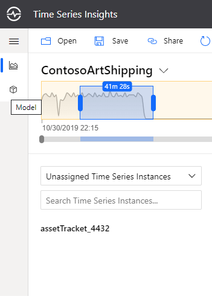

Time Series Insights Section of the 2019 Ignite Hands on Lab
-----------------------------------------

(Assuming that participants have gone through PnP, DPS and Hub steps prior)

Now that your device is sending data to the cloud, you'll need a data historian to not only store and retain data, but also for ad hoc querying and analysis, as well as visualizations. Introducing Azure Time Series Insights Preview (TSI). TSI is an end-to-end PaaS offering to ingest, process, store, and query highly contextualized, time-series-optimized, IoT-scale data. TSI is tailored towards the unique needs of industrial IoT deployments with capabilities including multi-layered storage, time series modeling, and cost-effective queries over decades of data. The Time Series Insights Preview pay-as-you-go (PAYG) SKU just launched additional features, many of which we will explore today.  
During the lab, you'll explore TSI by doing the following:  
* Provisioning an environment and event source  
* Exploring the various charting options  
* Authoring a Time Series Model  
* Adding an additional event source
* Doing an ad-hoc investigation

**Step 1: Create an Azure Time Series Insights Preview environment**

1. Sign-in to the Azure portal by using your subscription account.
2. Select Create a resource > Internet of Things > Time Series Insights.

3. In the Create Time Series Insights environment pane, on the Basics tab, set the following parameters:

**Parameter**|**Action**
-----|-----
Environment name|Enter a unique name for the Azure Time Series Insights Preview environment.
Subscription|Enter the subscription where you want to create the Azure Time Series Insights Preview environment. A best practice is to use the same subscription as the rest of the IoT resources that are created by the device simulator.
Resource group|Select an existing resource group or create a new resource group for the Azure Time Series Insights Preview environment resource. A resource group is a container for Azure resources. A best practice is to use the same resource group as the other IoT resources that are created by the device simulator.
Location|Select a datacenter region for your Azure Time Series Insights Preview environment. To avoid additional latency, it's best to create your Azure Time Series Insights Preview environment in the same region as your IoT Hub created by the device simulator.
Tier|Select PAYG (pay-as-you-go). This is the SKU for the Azure Time Series Insights Preview product.
Property ID|Enter a value that uniquely identifies your time series instance. The value you enter in the Property ID box is immutable. You can't change it later. For this tutorial, enter iothub-connection-device-id. To learn more about Time Series ID, see Best practices for choosing a Time Series ID.
Storage account name|Enter a globally unique name for a new storage account.
Enable Warm Store?|Select Yes to enable warm store.
Data Retention (days)|Choose the default option of 7 days

4. Click on “Next: Event Source” to establish a connection between your IoT Hub and TSI:

**Parameter**|**Action**
-----|-----
Create an event source?|Select Yes.
Name|Enter a unique value for the event source name.
Source type|Select IoT Hub.
Select a hub|Choose Select existing.
Subscription|Select the subscription that you're using for the lab.
IoT Hub name|Select the IoT Hub that was created in a previous step.
IoT Hub access policy|Select iothubowner.
IoT Hub consumer group|Select New, enter a unique name, and then select Add. The consumer group must be a unique value in Azure Time Series Insights Preview.
Timestamp property|This value is used to identify the Timestamp property in your incoming telemetry data. Leave this box empty. When left empty, Time Series Insights will default to the message enqueued timestamp set by IoT Hub or Event Hub. This is sufficient for the lab.

5. Click on “Review + create”

6. Review the values entered and click “Create”

7. Once your deployment is complete, navigate to your new Time Series Insights resource in the Azure portal. You should have access to your environment by default. To verify, select "Data Access Policies" under "Settings." If you do not see your credentials listed, grant yourself access by clicking "Add" and searching for your identity.

**Step 2: Explore data in your TSI Environment**

In this section, you will explore data in your new environment via the Azure Time Series Insights Preview explorer.

1. On the "Overview" pane you'll see the link to your TSI explorer:

2.  Wait for the environment to load in the browser. Once it loads, you'll be on the default landing page. Some of the key features include:

* Selecting a time range: You can select a different time range by dragging the handles of the availability picker or using the date-time selector in the top right corner. You can expand the bar to see the volume of data over time, or keep it collapsed for a slimmer look. Any time selection that is within the orange bar boundary will query your Time Series Insights environment's warm store. Warm storage is configurable for up to 31 days retention and is designed for frequent querying of recent data. There is no charge for these queries.

* Hierarchy: On the left, you'll see the Time Series Model (TSM) hierarchy. Time series that are not yet configured to a hierarchy will fall under the default of "Unassigned Time Series Instances."

* Plotting: In the middle of the page is the charting pane where you can visualize events and perform analysis. Below the charting pane is the well which offers additional settings such as time shift and step interpolations.

3. Click on your asset tracker, you'll see the properties available for plotting, click on “Show humidity." If your selected time range is narrow, expand to view more data. Click on additional properties to add them to the chart, including temperature, pressure, accelerometer, and latitude and longitude data:

You can increase the time interval:

Your plotted time series are shown below in the well, along with additional settings. Click on the gear icon for one of your selected variables to expand the settings, and toggle the options to see the various views available. You'll notice there is also a time shift setting. Time shift allows you to compare a tag to itself over a previous interval in time, and other tags plotted will be de-selected, but remain in the well. This is especially useful for data that is highly periodic or seasonal. You will need at least an hours' worth of data to view the time shift, thus it is not yet available for the lab, however the image below shows an example of what this might look like, using the overlap chart view. The ability to select custom time shift intervals in addition to the pre-selection options is on the product roadmap.

Uncheck every variable except for temperature, and then change the charting options to heat map:

**Step 3: Contextualize and Analyze data**

In the previous section, you charted raw data without contextualization. In this section, you will add time series model entities to contextualize your IoT data.
Time Series Model (preview) has 3 components: Types, Hierarchies and Instances.  
**Types** allow users to define calculations, aggregates, and categories over raw telemetry data, as well as define a tag for the sensor (example: Temperature sensor, Pressure sensor). This is achieved by authoring type variables. The DefaultType is pre-configured with three variables: temp, humidity, and EventCount, which can easily be removed or updated if need be.  
**Hierarchies** allow users to specify the structure of their assets. For example, an organization has buildings and buildings have rooms which contain IoT devices. The hierarchy structure in this case will be (Delivery Routes -> ParcelID).  
**Instances** enrich incoming IoT data with device metadata. An instance links to 1 type definition and multiple hierarchy definitions.

1. In the upper left part of the explorer select the Model tab:

2. Next we will update the DefaulType and create a categorical variable. Categorical variables allow you to map a discrete value received in an event payload to a specific category label. This enables you to give greater meaning or context to your streaming data, and to ask questions such as "over the past interval, what was the count for a specific category?" Soon you'll be leveraging other Azure services to build an anomaly detection pipeline. ContosoArtShipping ships high-value, original, or highly sentimental artwork, and their trucks have climate-controlled environments. Given the delicate nature of art, significant variations in temperature could cause mild to severe damage, and thus operators want to be alerted to any changes to the shipping environment. We will create a categorical variable that will help label anomalies.  

Click on "Types," and on the far right, under "Actions," select the pencil icon.

Update the Name from DefaultType to Asset Tracker  

Update Description from Default type to "Asset tracker equipped with seven sensors"  

Click on "Variables" and select "Add Variable"

Enter the following:

Name: condition  
Kind: Categorical  
Value: Select Custom and paste the following: tolong($event.temperature_anomaly.Double)
Categories:  
Label Value  
OK 0  
NOK 1

Default Category: Unknown  
Expand Advanced Options  
Filter (optional): (tolong($event.temperature_anomaly.Double)) != null

Click "Apply" and "Save"

The tracker currently does not have a temperature_anomaly property, however, we're able to author the variable in anticipation of this value being populated in the future. After anomaly detection has been created, we will come back to TSI to view the parcel's condition.

Now that we've explicitly defined a variable on the Asset Tracker type, the auto-discovered properties that we were able to chart in the previous step need to be added as well. Let's expedite this process by uploading a JSON file with these updates:  

Open and save a local copy of the 

Click on "Upload JSON," "Choose File" and select the saved JSON and click "Upload." The type variable count should change to 17.

3. The next step is to add a hierarchy. In the Hierarchies section, select + Add

4. A modal will open. Add the following values:
Name: Delivery Routes
Levels:
Name:  
Route Name (click "+ Add Level" to expand)  
ParcelID

Click "Save"

5. Next, click on “Instances” and open the edit modal by clicking the pencil icon under "Actions." Verify that the Type in the drop-down is now Asset Tracker. Select "Instance Fields" and check Delivery Routes to associate this instance with your hierarchy.  
Enter the following:  
Route Name (from hierarchy) : Redmond-Seattle  
ParcelD (from hierarchy) : Enter a unique identifier for the artwork shipment that your asset tracker is currently tracking

  
Click "Save"

6. Navigate back to the Analyze tab and change from heat map back to a line chart. In the hierarchy pane, you should now find your tracking device in the Delivery Routes hierarchy under the Redmond-Seattle route, associated to the correct parcel.

# TODO: narration to change segments to detection anomaly portion. This has already been briefly introduced, see line 104

**Step (TODO insert step): Enable a Second Event Source**

1. In the Azure portal, navigate to your TSI instance and click on "Event Sources." Select "Add." Complete all the necessary fields, selecting the Event Hub you configured as the output for the ASA job. You can select the $Default consumer group and leave the Timestamp property blank.

2. In general, we see three categories of responses to compute processing for anomaly detection or other purposes: visualization, alerting, and automation. Your solution might be connected to one or many external systems, and depending on your business needs you might utilize a mixture of these responses. After receiving an alert, you as a manager at ContosoArtShipping come to the TSI explorer to gather more information. Either remove or de-select all data streams except for temperature, lat, lon, and condition. The categorical variable for condition will appear as a colored bar, and a multi-colored bar indicates that there is more than one label value present in the selected time range. In the charting options, click on the Marker feature and drop a marker over the start of the anomaly. This allows you to see the exact location when the temperature began to fluctuate:

This illustrates the ability of the Time Series Insights preview explorer to help in ad-hoc investigations or post-mortems.  

3. Time Series Insights has released a Power BI connector in preview. You can capture the query for the current chart by selecting "More Actions" > "Connect to Power BI" on the top right of the chart. You have the option to select aggregated data, or raw events.  

Leaders in your organization might want to have an easy-to-consume snapshot of your organization's overall health, and the Power BI connector enables you to create dashboards that display data from a varitey of sources--operational data can be displayed along with information from finance and accounting.

In the final section, you'll finish with a map rendering using Azure Maps and the TSI JavaScript SDK.

